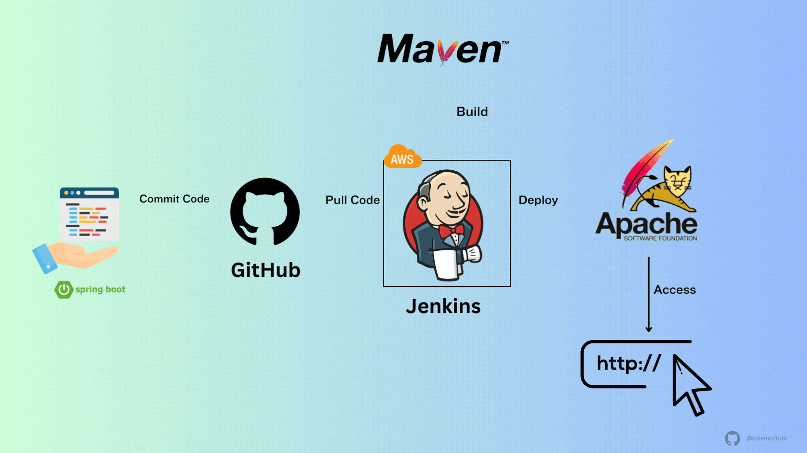

# Deploy-Jenkins-on-Ubuntu-EC2-Instance
This project demonstrates how to deploy Jenkins on an Ubuntu EC2 instance in AWS and configure it to automate a CI/CD pipeline integrating GitHub, Maven, and Apache Web Server.

### 📸 Project Diagram "JENLINS ARCHITECTURE" 


The pipeline fetches source code from GitHub, builds the application using Maven, and deploys it automatically to an Apache web server accessible over the Internet. This setup simulates a real-world DevOps pipeline for continuous integration and delivery using Jenkins.


## ⚙️ Architecture Summary

- GitHub → Hosts the source code repository
- Jenkins (Ubuntu EC2) → Automates build, test, and deployment stages
- Maven → Builds and packages the Java application
- Apache Web Server → Hosts the deployed web application
- Internet Access → Allows developers and users to access Jenkins and the web app

## 🧩 Tools & Technologies

- AWS EC2 (Ubuntu 22.04)
- Jenkins
- GitHub
- Maven
- Apache HTTP Server
- Java (JDK 11+)
- Firewall Configuration / Security Groups

## 🪜 Implementation Steps Summary
### 1. Launch EC2 Instance on AWS The EC2 instance must be launche in a `PUBLIC subnet` and should be attache to a SG with inbound role `TCP on port 8080 to your IP address` and `SSH on port 22 to 0.0.0.0/0`. Then we install jenkins by using the following steps below or by going to the official documentation Read [this page](https://www.jenkins.io/doc/book/installing/linux/#debianubuntu) for more information about the syntax to use.


### 2. Deploy Jenkin in ubuntu ec2 instance. `NB` In case we are working with Linux-ec2-instance we change the package manager of ubuntu `apt` to linux `yum`.
#### `In steps 1` `INSTALL JAVA SDK` 
1. Take up our privilage. The first command for ubuntu and the second for linux and verify if java is install
```
sudo su - ubuntu
```
```
sudo su - ec2-user
```
```
java --version
```
1. We need to update the OS
```
sudo apt update

```
2. Then we install java package 
```
sudo apt install fontconfig openjdk-21-jre

```
3. Verified if the java package was succesfully install 
```
java --version

```


#### `In steps 2`  `ADD JENKINS TO DEBIAN REPO`
1. We do this by using the Long term support release 
```
sudo wget -O /usr/share/keyrings/jenkins-keyring.asc \
  https://pkg.jenkins.io/debian-stable/jenkins.io-2023.key

``` 
```
echo deb [signed-by=/usr/share/keyrings/jenkins-keyring.asc] \
  https://pkg.jenkins.io/debian-stable binary/ | sudo tee \
  /etc/apt/sources.list.d/jenkins.list > /dev/null

```

#### `In steps 4` `INSTALL JENKINS`
1. We first update the libriaries 
```
sudo apt-get update

```
2. install jenkins  
```
sudo apt-get install jenkins -y

```


3. This command will check if jenkins has been install and working `DON'T FORGET TO COPY AND SAVE THE ADMIN PASSWORD` It may also be found  `/var/lib/jenkins/secrets/initialAdminPassword`
```
sudo systemctl status jenkins

```
4. Retrieve admin password: `DON'T FORGET TO COPY AND SAVE THE ADMIN PASSWORD`
```
sudo cat /var/lib/jenkins/secrets/initialAdminPassword

```
5. start jenkins `enable` allow you to state the service automatically when the system bot up or when you bot up the system 
```
sudo systemctl enable jenkins

```

#### `In steps 5` `ENABLE PORT 8080 ON HOST FIREWALL`
1. We first update the libriaries. `ufw` this is a virtual firewall on ubuntu instance 
```
sudo ufw enable

```
2. Then we allow port `8080`. This will allowed all incomming requese coming from this port. We do this because by default http run on port 80 while jenkins on port 8080. So we must always indicate the port of jenkins if not it will not work   
```
sudo ufw allow 8080

```
3. Then we may also need to open SSH   
```
sudo ufw allow openSSH

```


### 3. Access jenkins webpage with your Public Ips address of the ec2 server.  
```
http://<EC2-Public-IP>:8080
```


- Place the password generate in steps above
- Install suggested plugins
- create your Admin User and password or skip and continue as admin


## Author
FOKOUE THOMAS 