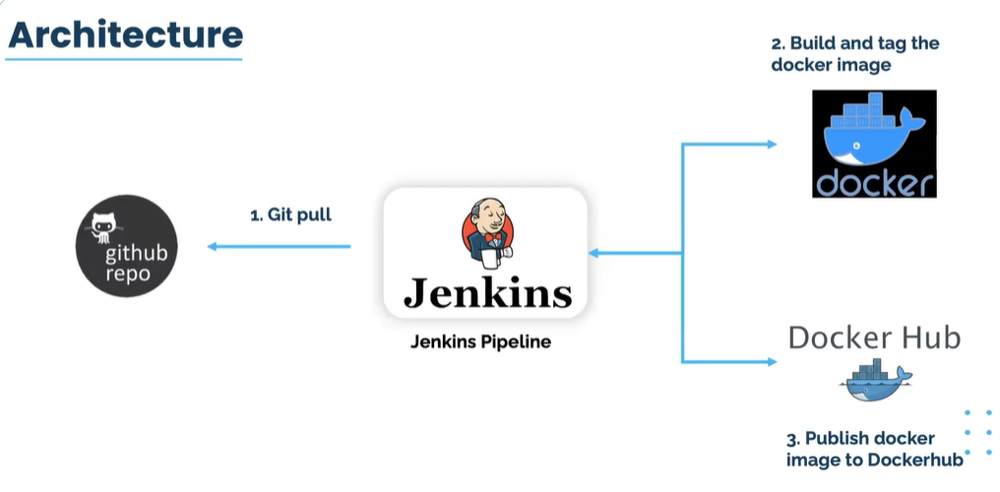

# Deploy-Jenkins-on-Ubuntu-EC2-Instance
This project demonstrates how to deploy Jenkins on an Ubuntu EC2 instance in AWS and configure it to automate a CI/CD pipeline using Jenkins, GitHub, and Docker Hub.

## 📸 Project Diagram "JENKINS ARCHITECTURE" 



In this project, we’ll build a complete CI/CD pipeline using Jenkins, GitHub, and Docker Hub. Every time we push code to GitHub, Jenkins will automatically:

- Pull the latest changes
- Build a new Docker image
- Tag and publish it to Docker Hub

This workflow is a real-world DevOps use case that automates container builds and image publishing — a fundamental skill for any DevOps Engineer or Cloud Developer.

## ⚙️ Architecture Summary

- GitHub → Hosts the source code repository
- Jenkins (Ubuntu EC2) → Automates build, test, and deployment stages
- Docker → Containerization
- Docker Hub → Image registry
- Internet Access → Allows developers and users to access Jenkins and the web app

## 🧩 Tools & Technologies

- AWS EC2 (Ubuntu 22.04)
- Jenkins
- GitHub
- Docker
- Docker Hub
- Java (JDK 11+)
- Firewall Configuration / Security Groups

## 🪜 Implementation Steps Summary
### 1. Launch EC2 Instance on AWS The EC2 instance must be launche in a `PUBLIC subnet` and should be attache to a SG with inbound role `TCP on port 8080 to your IP address` and `SSH on port 22 to 0.0.0.0/0`. Then we install jenkins by using the following steps below or by going to the official documentation Read [this page](https://www.jenkins.io/doc/book/installing/linux/#debianubuntu) for more information about the syntax to use.


### 2. Deploy Jenkin in ubuntu ec2 instance. `NB` In case we are working with Linux-ec2-instance we change the package manager of ubuntu `apt` to linux `yum`.
#### `In steps 1` `INSTALL JAVA SDK` 
1. Take up our privilage. The first command for ubuntu and the second for linux and verify if java is install
```
sudo su - ubuntu
```
```
sudo su - ec2-user
```
```
java --version
```
2. We need to update the OS
```
sudo apt update

```
3. Then we install java package 
```
sudo apt install fontconfig openjdk-21-jre

```
4. Verified if the java package was succesfully install 
```
java --version

```


#### `In steps 2`  `ADD JENKINS TO DEBIAN REPO`
1. We do this by using the Long term support release 
```
sudo wget -O /usr/share/keyrings/jenkins-keyring.asc \
  https://pkg.jenkins.io/debian-stable/jenkins.io-2023.key

``` 
```
echo deb [signed-by=/usr/share/keyrings/jenkins-keyring.asc] \
  https://pkg.jenkins.io/debian-stable binary/ | sudo tee \
  /etc/apt/sources.list.d/jenkins.list > /dev/null

```

#### `In steps 4` `INSTALL JENKINS`
1. We first update the libriaries 
```
sudo apt-get update

```
2. install jenkins  
```
sudo apt-get install jenkins -y

```


3. This command will check if jenkins has been install and working `DON'T FORGET TO COPY AND SAVE THE ADMIN PASSWORD` It may also be found  `/var/lib/jenkins/secrets/initialAdminPassword`
```
sudo systemctl status jenkins

```
4. Retrieve admin password: `DON'T FORGET TO COPY AND SAVE THE ADMIN PASSWORD`
```
sudo cat /var/lib/jenkins/secrets/initialAdminPassword

```
5. start jenkins `enable` allow you to state the service automatically when the system bot up or when you bot up the system 
```
sudo systemctl enable jenkins

```

#### `In steps 5` `ENABLE PORT 8080 ON HOST FIREWALL`
1. We first update the libriaries. `ufw` this is a virtual firewall on ubuntu instance 
```
sudo ufw enable

```
2. Then we allow port `8080`. This will allowed all incomming requese coming from this port. We do this because by default http run on port 80 while jenkins on port 8080. So we must always indicate the port of jenkins if not it will not work   
```
sudo ufw allow 8080

```
3. Then we may also need to open SSH   
```
sudo ufw allow openSSH

```


### 3. Access jenkins webpage with your Public Ips address of the ec2 server.  
```
http://<EC2-Public-IP>:8080
```


- Place the password generate in steps above
- Install suggested plugins
- create your Admin User and password or skip and continue as admin


### 4. Let create our first jenkins job that display `Hello World!` 
1. click on `New Item`(That means i would like to create a job)
2. Enter an item name `my-first-jenkins-job` select an item type `Freestyle project` and press `OK`
3. Click on the newly created job `my-first-jenkins-job`
4. Go to `Configure` add a `description` go down to `Build Steps` and select `Execute shell` and add what you whan to build e.g `echo Hello World!`
5. Save and run your build by clicking on `Build Now`
6. On your `Build History` on the left click on the first build "#1" and go to `Console Output` and you will see your result.


### 5. Create a GitHub repository with index.html file and a Dockerfile. You can as well pull mu own repo. 
```
git pull https://github.com/Fokoue22/docker-and-jenkins-integration.git
```


### 6. Let setup our Git plugin on Jenkins. This is done to link our Jenkins with our repo created on Git
1. Create a `New Item` with name `docker-image-build` select an item type `Freestyle project` and press `OK`
2. Click on the newly created job `my-first-jenkins-job`
3. Go to `Configure` add a `description`. Now go to `Source Code Management` click `Git`  filled all the blank space all 
4. After that on Branch change from master to `main`
5. Save and run your build by clicking on `Build Now`
6. On your `Build History` on the left click on the first build "#1" and go to `Console Output` and you will see your result.


### 7. Let look for a Plugin that will help us to publish a docker image. 
1. Go to `Manage Jenkins` click on `Plugins` then go to `Available Plugins`
2. On Available Plugins click on the search bar and type `CloudBees Docker Build and Publish` Select the Plugins and Install 
4. Go to `Install Plugins` to see the docker plugin that have been install  


### 8. Now let Installed docker on our Ubuntu server in other for us to use the plugin install above linux server:
- Take up you privilage. the first command for ubuntu and the second for linux. 
```
sudo su - ubuntu
```
```
sudo su - ec2-user
```
- let verifie if docker is install 
```
 docker --version
```
- After the verification we notice docker is not install. So we need to go to the officail documentation [this page](https://docs.docker.com/engine/install/ubuntu/) depending on our OS we follow the steps and install. For us is Installing Docker on Linux 
- Update the installed packages and package cache on your instance.
```
 sudo apt update -y
```
- Before you install Docker Engine for the first time on a new host machine, you need to set up the Docker apt repository. Afterward, you can install and update Docker from the repositor
```
 # Add Docker's official GPG key:
sudo apt-get update
sudo apt-get install ca-certificates curl
sudo install -m 0755 -d /etc/apt/keyrings
sudo curl -fsSL https://download.docker.com/linux/ubuntu/gpg -o /etc/apt/keyrings/docker.asc
sudo chmod a+r /etc/apt/keyrings/docker.asc

# Add the repository to Apt sources:
echo \
  "deb [arch=$(dpkg --print-architecture) signed-by=/etc/apt/keyrings/docker.asc] https://download.docker.com/linux/ubuntu \
  $(. /etc/os-release && echo "${UBUNTU_CODENAME:-$VERSION_CODENAME}") stable" | \
  sudo tee /etc/apt/sources.list.d/docker.list > /dev/null
sudo apt-get update
```
- Install the most recent Docker Community Edition package
```
 sudo apt-get install docker-ce docker-ce-cli containerd.io docker-buildx-plugin docker-compose-plugin
```
- Add the ubuntu and Jenkins to the docker group so that you can run Docker commands without using sudo.
```
 sudo usermod -a -G docker ubuntu
```
- After running the command above logout and login again for the permission to be succesfull.
```
 exit
```
- This command keep our docker up at all time. No matter if our instance is stop docker will still be active in this server. 
```
 sudo systemctl enable docker
```
- Activate docker and verify that the ubuntu can run Docker commands without using sudo.
```
 sudo systemctl status docker
```
```
 docker ps
```


### 9. Create a Build Steps in Jenkins for Docker
1. Go to our  a `New Item` with name `docker-image-build` created above
2. Go down to `Build Steps` and chose `Docker Build and Publish` 
3. On `Repository Name` add a repo-name present in your Docker Hub account. Add a `Tag e.g v2` leave everything default. Then add `Registry credentials` for your DockerHub account 


4. Before you save make sure to restart your Jenkins on your server. Then exit and login as jenkins 
```
 sudo systemctl start docker
 sudo usermod -aG docker jenkins
 sudo systemctl restart jenkins

```
```
 exit
```
```
 sudo su - jenkins
```
```
 docker info
```
4. Save and run your build by clicking on `Build Now`
5. On your `Build History` on the left click on the first build "#1" and go to `Console Output` and you will see your result.


### 9. Login to docker hub using ubuntu server.
```
docker login
```


## Author
FOKOUE THOMAS 